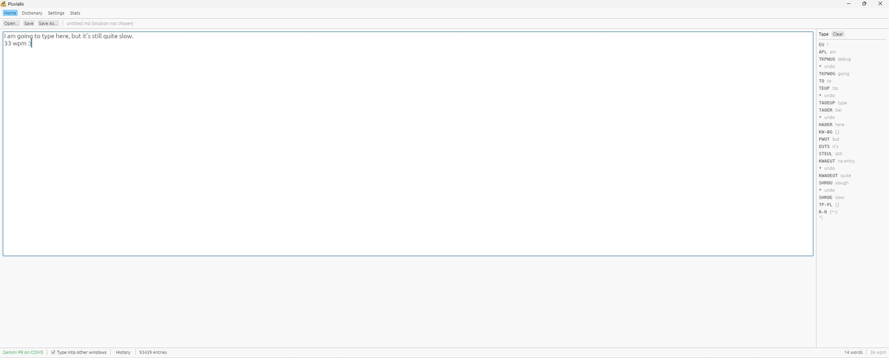

# Pluvialis

A stenography program for Windows, written in Rust.

Pluvialis translates chords from a steno writer into text, either into its own
editor or into whatever other application has focus. It is aimed at people who
write steno daily and want a tool that gets out of the way, in particular one
that connects to the writer without a setup ritual every session.



## Why it exists

Plover is excellent, but its Stenograph plugin cannot recover when the writer is
not present at the moment capture starts. If the machine is off, asleep, or
plugged in a second too late, the fix is to restart Plover and reselect the
machine, every session. Pluvialis exists to remove that ritual: it scans for a
writer continuously and connects the moment one appears, with no dialog and no
machine selection.

It is **not a fork or a port of Plover**. It is independently written, with
Plover's source read as a specification for the wire protocols and behaviour.
Two pieces of English-language data are copied from Plover so that orthography
matches (the American English word list and the 38 orthography rules); see
[ATTRIBUTION.md](ATTRIBUTION.md) for the precise record.

The name is from *Pluvialis*, the golden-plover genus (Latin *pluvia*, rain).

## Status

Early but working. On the author's hardware it connects to a Luminex CSE and a
Peregrine, translates against her real dictionaries, and renders unknown chords
in red in the live view. The translation core loads 101,407 dictionary entries
in about 50 ms and answers lookups in microseconds.

This is version 0.1.0 and the interface is still moving. It is developed against
one person's daily setup, so paths and assumptions elsewhere in the tree reflect
that.

## Features

- **Continuous auto-connect.** No dialog, no machine picker. Pluvialis keeps
  scanning and connects when a supported writer appears, including after an
  unplug or a power cycle.
- **Live editor with a caret.** Steno lands at the caret, so retroactive
  correction works and you can write mid-document or type by hand without the
  two fighting.
- **Untranslated chords shown in red**, attached to the characters they belong
  to, so they survive edits until undone.
- **Type into other applications.** When another window has focus, steno is sent
  as real keystrokes; when Pluvialis has focus, it goes to the in-app document.
  Never both.
- **Open / Save / Save As**, with autosave, timestamped version history thinned
  by age, and crash recovery.
- **A live words-per-minute meter** measured in real words, excluding pauses, so
  thinking does not count against the rate.
- **Bring your own dictionaries.** Import Plover JSON and Python dictionaries,
  then enable, disable, reorder by priority, and look up outlines or words in the
  Dictionaries pane. Which dictionaries are enabled is remembered between runs.
- **Command-line tools** for looking up outlines, checking dictionaries, and
  cleaning invalid entries.

## Machine support

Pluvialis auto-detects two protocol families. It tries them in this order:

1. **Stenograph USB** (Windows only): the Luminex CSE and relatives.
2. **Gemini PR** over USB serial: the Peregrine, and other keyboards or serial
   devices that speak Gemini PR.

If both are attached, the Stenograph writer is preferred. Other steno protocols
(TX Bolt, Stentura, Passport, ProCAT, plain NKRO keyboard, and so on) are not
implemented.

## Dictionaries

A fresh Pluvialis starts with **no dictionaries**. You add your own, and
Pluvialis copies each into `dictionaries\` and owns that copy: the file it reads
is one nothing else writes to, so it can never be changed underneath you by
another program. The original you imported from is left untouched. You can edit
the copies directly in an editor.

Add a dictionary with the **Add dictionary** button in the Dictionaries pane, or
from the command line with `pluvialis import <FILE>`. Both accept Plover `.json`
and `.py` dictionaries and refuse anything else.

- **JSON dictionaries** (RTF/CRE format) load enabled, in priority order.
- **Python dictionaries** (Plover's `.py` dictionaries, such as jeff-phrasing)
  run as written through an embedded CPython interpreter. They are discovered
  and loaded **disabled**, appearing with a checkbox you tick to enable. A
  Python dictionary is arbitrary code with no sandbox, the same trust model as
  Plover.

Running Python dictionaries requires **CPython 3.12 or newer** to be installed
and findable on the DLL search path. The executable links the stable ABI
(`python3.dll`), so any 3.12+ install works; it is not tied to one version.

## Building

Requires the Rust toolchain (edition 2024, Rust 1.97 or newer) with the MSVC
toolchain on Windows, and a CPython 3.12+ install for the Python dictionary
support.

```
cargo build --release
```

The application binary is `target\release\pluvialis-app.exe`.

Run the tests and the linter (both must be clean):

```
cargo test --workspace
cargo clippy --workspace --all-targets -- -D warnings
```

## Running

With no arguments, the executable opens the GUI:

```
target\release\pluvialis-app.exe
```

It also has command-line subcommands, useful for diagnosing dictionaries and the
machine layer without the GUI:

- `lookup <OUTLINE>...` answers from the real dictionaries, with timings.
- `check [DICT...]` formats every entry and reports unimplemented meta commands.
  It exits non-zero on anything new, so it doubles as a regression check.
- `clean [--write] [DICT...]` removes entries whose keys are not valid steno. It
  is a dry run unless `--write` is given, and it keeps the original alongside.
- `machine [SECONDS]` runs the Auto scanner and prints every status change and
  stroke. Set `RUST_LOG=pluvialis_machine=trace` for per-attempt detail.

## Architecture

A Cargo workspace of five crates, split so that OS-specific and
machine-specific code stays quarantined:

| Crate | Responsibility |
|---|---|
| `pluvialis-core` | Strokes, keymaps, dictionary load and lookup, translator, formatter, undo history |
| `pluvialis-machine` | The `Machine` trait, the Auto scanner, and each protocol |
| `pluvialis-output` | Keystroke emulation into other applications (Win32 `SendInput`) |
| `pluvialis-python` | Plover's Python dictionaries, run through embedded CPython |
| `pluvialis-app` | The egui/eframe GUI, documents, autosave, versioning, and config |

## Licence

**GPL-3.0-or-later.** See [LICENSE](LICENSE) for the full text and
[ATTRIBUTION.md](ATTRIBUTION.md) for what is derived from Plover and why the
licence follows. Plover is GPL-2.0-or-later, and the "or later" makes GPL-3
compatible with the material Pluvialis embeds.
